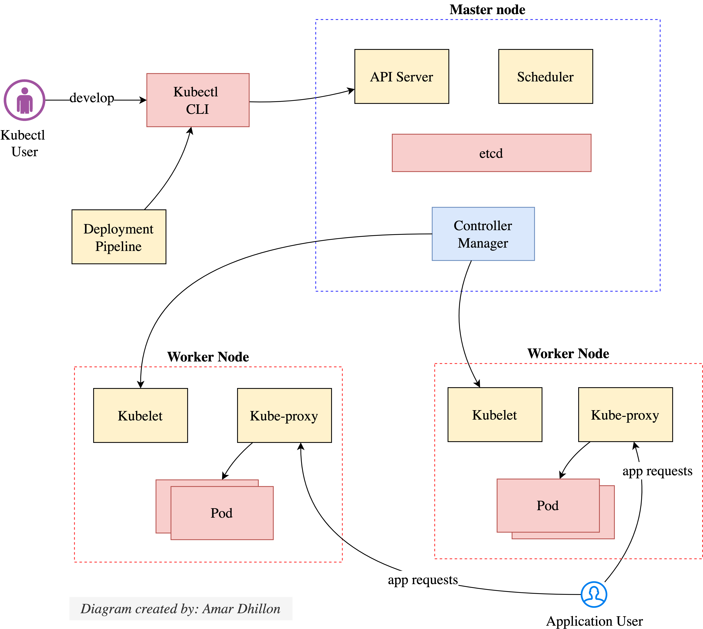

# K8S Architecture

!!! info "K8S on high level"
    - A Kubernetes cluster consists of a master, which manages the cluster, and nodes, which run the services.
    -  Developers and the deployment pipeline interact with Kubernetes through the API server, which along with other cluster-management software runs on the master.
    -  Application containers run on nodes.
    -  Each node runs a 
          -  Kubelet, which manages the application container
          -  kube-proxy, which routes application requests to the pods, either directly as a proxy or indirectly by configuring iptables routing rules built into the Linux kernel.

  

## Master Node

The master node consists of four components:

- **The API server** -  When you run commands on `kubectl`, this is what it communicated with to perform operations. The `API server` exposes an API for both external users and other components within the cluster.
- **The scheduler** — This is responsible for selecting an appropriate node where a `pod` will run, given priority, resource needs, and other constraints.
- **The controller manager** — This is responsible for executing `control loops`: the continual observe-diff-act operation that underpins the operation of Kubernetes.
- **A distributed key-value data store, etcd** — This stores the underlying state of the cluster and thereby makes sure it persists when nodes fail or restarts are required.

## Worker node

Each worker node uses the following components to run and monitor applications:

- **A container runtime** —  This can be Docker.
- **The kubelet** — This interacts with the Kubernetes master to start, stop, and monitor containers on the node.
- **The kube-proxy** — This provides a network proxy to direct requests to and between different pods across the cluster.